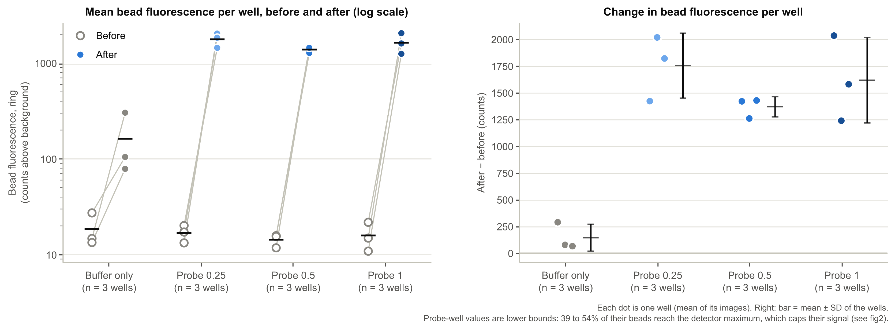
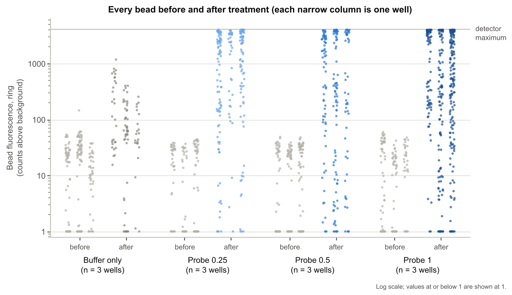

# Probe binding to silica beads: confocal image analysis

Analysis of confocal images (Olympus FV3000, .oir files) of silica beads before and after
treatment with a fluorescent probe at three concentrations, compared with a buffer-only control.
The aim: measure how much probe binds the beads, how binding depends on probe concentration, and
the signal-to-noise ratio (SNR).

## Key findings

- **The probe binds the beads.** At every concentration, bead fluorescence rose about 100-fold
  (from about 15 counts to 1,400 to 1,800 counts), roughly 10 times the rise seen with buffer
  alone. All three concentrations differ clearly from buffer (p = 0.0002 to 0.0011).
- **No increase with concentration was detected between 0.25 and 1 per 100 µL,** but this
  experiment can't settle the dose question: 39 to 54% of beads in the probe wells reached the
  detector's maximum, which caps their measured signal.
- **SNR is high at every concentration** (73 to 138) and highest at 0.25. The higher-concentration
  wells had more background around the beads, and more noise in it (50 to 75 counts, vs 32 with
  buffer), while bead signal was not higher. This is descriptive, and it can't be separated from
  the order in which the wells were imaged.
- **Buffer-only beads also brightened** between the two days (from 18 to 162 counts on average;
  all three buffer wells rose), so probe effects are measured against buffer, not against zero.

## The experiment

| Wells | Treatment (per 100 µL) | Code in file names |
|---|---|---|
| W1 to W3 | Probe 0.25 | P0.5 |
| W4 to W6 | Probe 0.5 | P1 |
| W7 to W9 | Probe 1 | P2 |
| W10 to W12 | Buffer only (annexin-V binding buffer) | AV1 |

- Each well was imaged at 3 positions before treatment (23 Sept 2026) and after treatment
  (24 Sept 2026). Channel 1 = probe fluorescence (488 nm excitation); channel 2 = transmitted light.
- The before and after images show different fields of view, so individual beads can't be
  followed from one day to the next.

## What was done, and why

| Step | What was done | Why |
|---|---|---|
| Find the beads | Beads were outlined on the **transmitted-light** image, not the fluorescence image. | So which beads are measured never depends on how bright they are: dim beads are measured as well as bright ones. |
| Measure each bead | Signal = mean of the bead's outer ring minus the local background just around it. | The probe binds at the bead surface. Subtracting the local background removes free probe in the surrounding liquid and uneven illumination. |
| Compare before and after | Each well's after-treatment beads were compared with the **same well's** before-treatment beads, as a population. | The fields differ between days, so beads can't be paired, but each well still serves as its own baseline. |
| Treat the well as the replicate | Beads were averaged per image, images per well; statistics use the 12 well values (3 per treatment). | Beads in one well share its pipetting, incubation and imaging, so they aren't independent. Treating hundreds of beads as separate samples would overstate certainty. |
| Choose the outcome | Each well's change in mean bead fluorescence (after minus before). | Fluorescence is the measure named in the study's aim. |
| Test 1: each probe vs buffer | Dunnett's test on the change, comparing each concentration with buffer only. | Buffer wells changed too, so the probe's effect is the change beyond buffer. Dunnett's test is built for several treatments against one control and corrects for making 3 comparisons. |
| Test 2: dose trend | Linear regression of the change on log2 concentration, probe wells only. | One test of whether binding grows with concentration, using all 9 probe wells. Log2 because the concentrations double, so each step is one unit. |

Only these two tests are run, each answering one question of the study; fewer tests mean fewer
chances of a false positive. Significance level: p < 0.05.

**Data issues found and how they were handled:**

| Issue | How it was handled |
|---|---|
| File codes don't match concentrations (P0.5 = Probe 0.25, P1 = Probe 0.5, P2 = Probe 1) | Treatments taken from the plate map by well number, not from the file names. |
| W4 and W7 carry the previous group's code (W4 named P0.5, W7 named P1) | Corrected to the plate map (W4 = Probe 0.5, W7 = Probe 1). |
| W4's first after-treatment images (12:59 to 13:02) look untreated, unlike its second set 5 minutes later | First set excluded; second set used. |
| Some positions saved more than once (`_0001`, `_0002`) | Retakes of the same field: one kept. Different fields: kept as extra images, with at most 3 per well, chosen by resolution and bead count, never by fluorescence. The files left out, and why, are listed in `settings.py`. |
| Some images at half resolution (1024 x 1024) | Kept, with the analysis settings scaled to their pixel size. |
| W6 after-treatment position 1 was never saved; W11 has no after-treatment position 1 | W6 uses 2 images. W11 uses a second field at position 2 instead. |

In total, 36 before and 35 after images were analysed (712 and 888 beads).

## What was found

### Images


One typical image per treatment, all shown with the same brightness scale (0 to 4000), chosen by
rule rather than by eye (the well whose change is closest to its treatment's median change, then
that well's image closest to the well mean). Before treatment, beads are only about 15 counts above
background and so look black on this scale; after probe they are bright rings.

### Bead fluorescence



Left: each well's mean bead fluorescence before (open) and after (filled) treatment; the bar is
the treatment mean. Right: each well's change, with the mean ± SD of the 3 wells.

| Treatment | Before (counts) | After (counts) | Change (95% CI) | Beads at detector maximum |
|---|---|---|---|---|
| Buffer only | 18 | 162 | 144 (−168 to 456) | 0% |
| Probe 0.25 | 17 | 1,770 | 1,753 (998 to 2,508) | 54% |
| Probe 0.5 | 14 | 1,383 | 1,369 (1,133 to 1,605) | 39% |
| Probe 1 | 16 | 1,633 | 1,617 (625 to 2,610) | 45% |

**Test 1, compared with buffer (Dunnett's test):**

| Probe | Change beyond buffer (95% CI) | p |
|---|---|---|
| 0.25 | +1,609 counts (991 to 2,228) | 0.0002 |
| 0.5 | +1,225 counts (607 to 1,843) | 0.0011 |
| 1 | +1,474 counts (856 to 2,092) | 0.0004 |

All three concentrations raised bead fluorescence far more than buffer did.

**Test 2, dose trend:** −68 counts per doubling of concentration (95% CI −378 to 242), p = 0.62.
No increase with concentration was detected. Because so many probe-well beads hit the detector
maximum, their true brightness is higher than measured and differences between concentrations
may be hidden; this result does **not** show that binding is independent of concentration.

### Every bead



Each dot is one bead; each narrow column is one well. The grey line at the top is the detector
maximum. After probe treatment most beads are far brighter than the untreated beads, and many
are piled against the maximum. Some beads in every probe well stay near background.

### Signal-to-noise ratio and background

SNR = a bead's signal divided by the standard deviation of the background around it (mean of all
beads, averaged over wells).

| Treatment | SNR before | SNR after | Background after (counts) |
|---|---|---|---|
| Buffer only | 3.8 | 31 | 32 |
| Probe 0.25 | 3.6 | 138 | 50 |
| Probe 0.5 | 3.0 | 83 | 62 |
| Probe 1 | 3.3 | 73 | 75 |

Untreated beads are barely above background (SNR 3 to 4). After probe, SNR is high at every
concentration and highest at 0.25. The higher-concentration wells also had more background and
more noise in it (before treatment the background was 27 to 29 counts in every group), while bead
signal was not higher; unbound probe in the liquid is the likely source. The probe wells were
imaged in order of concentration, so this pattern can't be separated from imaging order. These
values are descriptive (not tested), and saturation caps the SNR of the brightest beads as well.

## Limitations and recommendations

| Limitation | Effect | For future experiments |
|---|---|---|
| Detector saturation (39 to 54% of probe-well beads) | Probe-well fluorescence and SNR are underestimated; concentration differences may be hidden. | Lower the detector voltage or laser power so the brightest beads stay below the maximum; test settings on the highest concentration first. |
| Only 3 wells per treatment | Only large effects can reach significance; a non-significant result is not evidence of no effect. | Use more wells per treatment. |
| Before and after at different fields of view | Beads can't be paired, so only population averages are compared. | Save the stage positions and re-image the same fields after treatment. |
| Buffer-only beads brightened between days | Part of every change is not due to the probe; handled by comparing with buffer. | Include an untreated well imaged on both days, and a fluorescence reference slide to check day-to-day instrument drift. |
| No increase in signal from 0.25 to 1 per 100 µL | Any rising part of the dose-response curve may lie below 0.25, where it wasn't measured. | Add lower concentrations (below 0.25 per 100 µL). |
| W4's first after-treatment images looked untreated | If its probe was added late, W4 incubated for less time than the other wells. | Record the treatment time of each well. |
| File labelling errors and a missing position | Corrected from the plate map; W6 has 2 images instead of 3. | Use file codes that match the concentrations and check each well's name before saving. |

## Files and re-running

```
probe-analysis/
├── bead_segmentation.ijm   Fiji macro: finds the beads and measures their fluorescence
├── settings.py             plate map, images left out and why, figure colours
├── analyze.py              labels the images, calculates results, runs the statistics
├── make_figures.py         makes the figures from analyze.py's tables
├── data/                   raw .oir images
└── results/                macro output: bead_measurements.csv, segmentation_log.csv, qc/, rois/, figure_images/
    └── analysis/           Python output: tables, stats_report.txt (full statistics), figures
```

Requires Fiji (it includes Bio-Formats, which opens .oir files) and Python 3.10 or newer with the
packages in `requirements.txt`.

1. In Fiji, run `bead_segmentation.ijm` and choose the probe-analysis folder when asked. It reads
   `data/` and writes to `results/`; its settings are at the top of the macro.
2. From the project folder: `python3 analyze.py`, then `python3 make_figures.py`.

**Measurement settings** (1 pixel = 0.104 µm): beads kept if 3.8 to 7 µm across in transmitted
light (including the halo), circularity of that outline at least 0.75, not touching the image edge; threshold by
Otsu's method, never below 80. Outlines shrunk by 5 pixels to match the fluorescent ring; ring
width 5 pixels; background measured in a 10-pixel band starting 4 pixels outside the outline,
excluding pixels near other objects. Saturated = any pixel at 4095 (12-bit maximum).
