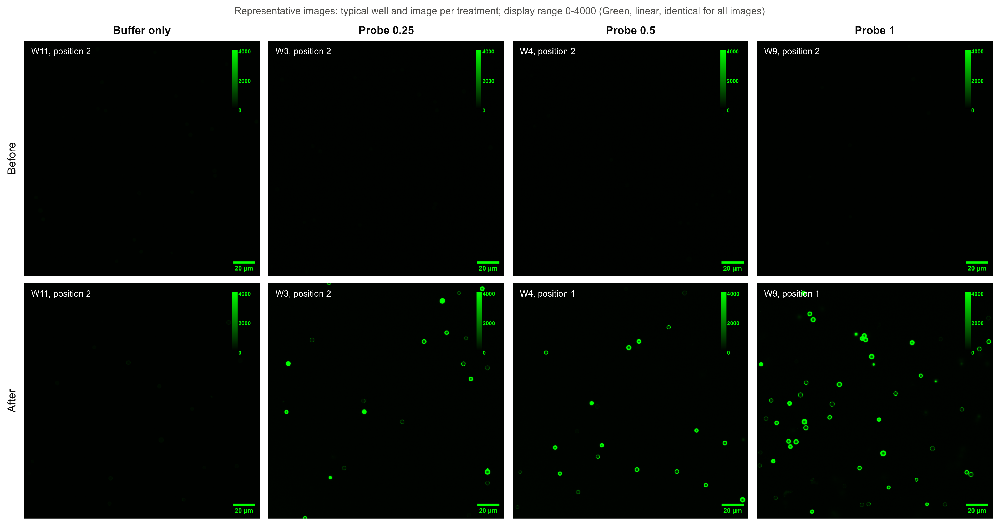

# Probe binding to silica beads: confocal image analysis

Analysis of confocal images (Olympus FV3000, .oir files) of silica beads before and after treatment
with a fluorescent probe, from two experiments analysed together: experiment 1 (dilutions 1:400, 1:200
and 1:100, against buffer only) and experiment 2 (dilutions 1:100000 to 1:1000, against a negative
control). The aim: measure how much probe binds the beads, whether the binding is specific, how it
depends on the dilution, and the signal-to-noise ratio (SNR).

## Key findings

- **The probe binds the beads, and the binding is specific.** At 1:3333, probe-treated beads gained
  243 counts, against 16 with the negative control at the same dilution: 227 counts more
  (95% CI 103 to 351, p = 0.015).
- **Binding grows with the amount of probe** across all 8 dilutions (Spearman's rho = 0.93,
  p < 0.0001). There is no detectable binding at 1:100000 or 1:10000, about 210 to 240 counts at 1:5000 and
  1:3333, about 1,380 at 1:1000 and about 2,070 to 2,330 at 1:400 to 1:100.
- **Half of the maximum binding is reached at about 1:1300,** from a dilution-response curve fitted to
  the probe wells (fig1, R² = 0.97).
- **At 1:1000 and 1:200 nearly every bead binds probe** (93% and 99% of beads positive), against 4%
  at 1:10000 (fig3).
- **Every dilution from 1:1000 to 1:100 raised bead fluorescence far beyond buffer** (1,233 to 2,183
  counts more than buffer alone; p < 0.0001 for each). At 1:3333 and more dilute, the change did not
  differ significantly from buffer's (145 counts).
- **The top of the curve can't be measured with these settings:** 43% of beads at 1:1000 and 61 to
  64% at 1:400 to 1:100 reached the detector's maximum, which caps their signal. Differences between
  1:400, 1:200 and 1:100 can't be judged.
- **The two experiments were run separately with no dilution in common,** so the step between
  1:400 (experiment 1) and 1:1000 (experiment 2) mixes dilution with any difference between the runs.
- **SNR follows binding:** 100 to 163 at 1:1000 to 1:100, 39 to 46 at 1:5000 and 1:3333, and at
  the level of untreated beads (4 to 7) at 1:10000, 1:100000 and in the negative control.

## The experiments

**Experiment 1** (after-treatment images taken the day after the before images)

| Wells | Treatment |
|---|---|
| W1 to W3 | Probe 1:400 |
| W4 to W6 | Probe 1:200 |
| W7 to W9 | Probe 1:100 |
| W10 to W12 | Buffer only (annexin-V binding buffer) |

**Experiment 2** (before and after treatment on the same day)

| Wells | Treatment |
|---|---|
| W1 to W3 | Probe 1:1000 |
| W4 and W5 | One set of before images, then separate portions at 1:3333, 1:5000 and 1:10000 |
| W6 | Probe 1:3333 |
| W7 to W9 | Probe 1:100000 |
| W12 to W14 | Negative control 1:3333 |

- Each well was imaged at 3 positions before and after treatment. Channel 1 = probe fluorescence
  (488 nm excitation); channel 2 = transmitted light.
- The fluorescence imaging settings were the same in both experiments (detector voltage, offset and
  gain, 488 nm laser power, zoom), so the counts are comparable.
- The before and after images show different fields of view, so individual beads can't be
  followed from one timepoint to the next.

## What was done, and why

| Step | What was done | Why |
|---|---|---|
| Find the beads | Beads were outlined on the **transmitted-light** image, not the fluorescence image. | So which beads are measured never depends on how bright they are: dim beads are measured as well as bright ones. |
| Leave out out-of-focus beads | Beads above or below the focal plane (bright or dark centre in transmitted light) and smeared blurs (soft edges) were left out, judged on the transmitted-light image only. | In a confocal image, a bead outside the focal plane looks dim whether or not probe is bound, so including it would understate binding. |
| Measure each bead | Signal = mean of the bead's outer ring minus the local background just around it. | The probe binds at the bead surface. Subtracting the local background removes free probe in the surrounding liquid and uneven illumination. |
| Compare before and after | Each well's after-treatment beads were compared with the **same well's** before-treatment beads, as a population. In experiment 2's W4 and W5, the one set of before images is the baseline for each of the three dilutions. | The fields differ between timepoints, so beads can't be paired, but each well still serves as its own baseline. |
| Treat the well as the replicate | Beads were averaged per image, images per well; statistics use 28 well values from 24 wells (2 or 3 per treatment). | Beads in one well share its pipetting, incubation and imaging, so they aren't independent. Treating hundreds of beads as separate samples would overstate certainty. |
| Combine the experiments | Both experiments were measured and analysed together as one set. Each well is identified by its number and treatment (the two experiments reuse well numbers, always for different treatments). | One dilution-response from 1:100000 to 1:100, with every dilution compared with the same buffer wells. |
| Choose the outcome | Each well's change in mean bead fluorescence (after minus before). | Fluorescence is the measure named in the study's aim. |
| Express the change as % fluorescence (fig1) | Each well's change as a percentage of the mean change at the strongest dilution (1:100). | Puts the dilution-response on a 0 to 100% scale. |
| Fit a dilution-response curve (fig1) | A 4-parameter logistic curve fitted to the well values: y = bottom + (top − bottom) / (1 + (D / D50)^hill), where 1:D is the dilution. | The standard model for a response that rises from a floor to a plateau; D50 is the dilution that gives half of the maximum. |
| Count positive beads (fig3) | A bead is positive if its signal is above the mean + 3 SD of all untreated (before-treatment) beads, 68.5 counts; each well's percentage is averaged over its images. | Only 2 of the 719 untreated beads (0.3%) pass this cutoff, so a positive bead has clearly bound probe. |
| Compare the groups in the bar charts (figs 2 and 3) | Fig 2: each treatment's before and after compared with a paired t-test on its wells, and the treatments' changes compared pairwise with Tukey's test. Fig 3: the dilutions' % of positive beads compared pairwise with Tukey's test. | The paired test uses each well as its own baseline. Tukey's test compares every pair of groups and corrects for making several comparisons. |
| Test 1: probe dilutions vs buffer | Dunnett's test on the change, comparing each probe dilution with buffer only. | Buffer wells changed too, so the probe's effect is the change beyond buffer. Dunnett's test is built for several treatments against one control and corrects for making 8 comparisons. |
| Test 2: probe vs negative control | Welch's t-test on the change, probe against the negative control at the same dilution (1:3333). | The negative control at the same dilution shows how much signal comes without specific binding. Welch's version doesn't assume the two groups vary equally. |
| Test 3: dilution trend | Spearman rank correlation of the change with the amount of probe, over all 8 probe dilutions (22 well values). | One test of whether binding grows as the probe is less diluted, across both experiments. Rank-based, because the detector caps the top of the curve, so the relation isn't a straight line. |

These three tests answer the study's questions. The bar charts (figs 2 and 3) also mark pairwise
comparisons, listed in the report; with 2 or 3 wells per group, only large differences can reach
significance. Significance level: p < 0.05.

**Data issues found and how they were handled:**

| Issue | How it was handled |
|---|---|
| Experiment 1 file codes don't match the dilutions (P0.5 = 1:400, P1 = 1:200, P2 = 1:100), and W4 and W7 carry the previous group's code | Images renamed with the correct treatment from the plate map (`images/name_map.csv` lists the original names). |
| In experiment 1, W4's first set of after-treatment images looks untreated, unlike its second set taken 5 minutes later | First set not used; second set used. |
| Some experiment 1 positions saved more than once (`_0001`, `_0002`) | Retakes of the same field: only the latest full-resolution save kept. Different fields: kept as extra images (marked "b"), with at most 3 per well, chosen by bead count, never by fluorescence. |
| Some experiment 1 images at half resolution (1024 x 1024) | Kept, with the analysis settings scaled to their pixel size. |
| In experiment 1, W6 after position 1 was never saved and W11 has no after position 1 | W6 uses 2 images. W11 uses a second field at position 2 instead. |
| In experiment 2, W12 has no before image at position 2, and in two negative-control images (W12 after position 2, W13 before position 1) no bead passed the checks | W12 and W13 use 2 images at those timepoints. |
| The negative-control wells hold few beads (4 to 10 per well and timepoint) among much small debris | Analysed as they are; their mean is less precise than the others. |
| Two background images (negative-control W12 and W13) | Not analysed: they are background images, not bead fields. |

In total, 70 before and 82 after images were analysed (719 and 934 beads). The focus checks left
out 42% of the beads found before treatment and 29% after.

## What was found

In the figures, buffer only is labelled Annexin-V, and each probe treatment by its dilution alone.

### Images



One typical before and after image per treatment, all shown with the same brightness scale
(0 to 4000), chosen by rule rather than by eye (the well whose change is closest to its treatment's
median change, then that well's image closest to the well mean). Before treatment, beads are only
about 25 counts above background and so look black on this scale; after probe they are rings whose
brightness follows the dilution.

### Bead fluorescence

| Treatment | Before (counts) | After (counts) | Change (95% CI) | Beads at detector maximum |
|---|---|---|---|---|
| Buffer only | 26 | 171 | 145 (−141 to 431) | 0% |
| Negative control 1:3333 | 22 | 38 | 16 (−5 to 38) | 0% |
| Probe 1:100000 | 25 | 21 | −4 (−7 to −1) | 0% |
| Probe 1:10000 | 29 | 31 | 2 (−113 to 117) | 0% |
| Probe 1:5000 | 29 | 238 | 209 (−1,019 to 1,436) | 0% |
| Probe 1:3333 | 28 | 271 | 243 (115 to 372) | 0% |
| Probe 1:1000 | 30 | 1,408 | 1,378 (791 to 1,965) | 43% |
| Probe 1:400 | 26 | 2,092 | 2,066 (1,513 to 2,618) | 62% |
| Probe 1:200 | 25 | 2,157 | 2,131 (1,526 to 2,737) | 61% |
| Probe 1:100 | 27 | 2,354 | 2,328 (1,743 to 2,912) | 64% |

1:5000 and 1:10000 have only 2 wells each, so their confidence intervals are very wide.

**Test 1, each probe dilution compared with buffer (Dunnett's test):**

| Dilution | Change beyond buffer (95% CI) | p |
|---|---|---|
| 1:100000 | −149 counts (−576 to 278) | 0.86 |
| 1:10000 | −143 counts (−620 to 334) | 0.93 |
| 1:5000 | +64 counts (−413 to 541) | > 0.99 |
| 1:3333 | +99 counts (−328 to 526) | 0.98 |
| 1:1000 | +1,233 counts (806 to 1,660) | < 0.0001 |
| 1:400 | +1,921 counts (1,494 to 2,348) | < 0.0001 |
| 1:200 | +1,987 counts (1,560 to 2,414) | < 0.0001 |
| 1:100 | +2,183 counts (1,756 to 2,610) | < 0.0001 |

From 1:1000 to 1:100 the probe raised bead fluorescence far more than buffer did. At 1:3333 and more
dilute, the change did not differ significantly from buffer's (145 counts). The buffer wells were all
in experiment 1, so the experiment 2 dilutions are compared with a control from another run; Test 2
compares 1:3333 with a negative control imaged alongside it.

**Test 2, probe compared with the negative control at 1:3333 (Welch's t-test):** +227 counts
(95% CI 103 to 351), p = 0.015. The probe binds the beads beyond what the negative control shows.

**Test 3, dilution trend (Spearman):** rho = 0.93, p < 0.0001 (22 well values). Binding rises with
the amount of probe. Within experiment 1 alone, where most beads are saturated, the change barely
rises (2,066 to 2,328 counts), so the trend comes from the experiment 2 dilutions and the step between
the two experiments. Because the experiments share no dilution, part of that step may reflect
differences between the runs rather than dilution alone. Experiment 2's W4 and W5 count once for each
of their three dilutions.

### Dilution-response


Each dot is one well: its change from before to after, as a percentage of the mean change at 1:100,
the strongest. The black bars are the mean ± SD of the wells, and the curve is a 4-parameter logistic
fitted to the well values:

y = −0.9 + 100.1 / (1 + (D / 1282)^1.71), R² = 0.97, where 1:D is the dilution.

No binding is detectable at 1:100000 or 1:10000. Binding reaches 9% of the maximum at 1:5000 and 59%
at 1:1000, then levels off at 89 to 100% from 1:400 on, where most beads are at the detector maximum.
The curve's midpoint, half of the maximum, is at about 1:1300. The 1:3333 wells are shown with their
controls in the next figure instead.

### Probe against the controls


Mean bead fluorescence of the wells before (open bars) and after (filled bars) treatment, ± SD. Before
treatment all three groups are at 22 to 28 counts. After, the probe at 1:3333 rises to 271 counts and
the negative control at the same dilution only to 38. The Annexin-V (buffer only) wells rose to 171
on average, but very unevenly (SD 117).

Brackets over each pair compare before with after (paired t-test); brackets between groups compare
their change from before to after (Tukey's test). * p < 0.05, ** p < 0.01, *** p < 0.001, ns = not
significant. Only the probe at 1:3333 changed significantly (p = 0.015), and its change was larger
than the negative control's (p = 0.021). Annexin-V's rise was not significant (p = 0.16) because its
wells varied widely, and its change did not differ significantly from either 1:3333 group.

### Positive beads


A bead counts as positive if its signal is above 68.5 counts, the mean + 3 SD of all 719 untreated
beads. Bars are the mean of the wells, ± SD (kept within 0 to 100%).

| Dilution | Positive beads after treatment |
|---|---|
| 1:10000 | 4% (± 6) |
| 1:1000 | 93% (± 6) |
| 1:200 | 99% (± 1) |

Brackets compare the dilutions pairwise (Tukey's test). 1:10000 differs from both 1:1000 and 1:200
(p < 0.0001 for each); 1:1000 and 1:200 do not differ significantly (p = 0.32), as both are near 100%.

### Change per well


Each dot is one well's change from before to after, in counts above background, for the probe
dilutions in fig1; the black bars are the mean ± SD of the wells. It shows the data of fig1 in counts
rather than as a percentage, without the fitted curve.

### Signal-to-noise ratio and background

SNR = a bead's signal divided by the standard deviation of the background around it (averaged over
the beads in each image, the images in each well, then the wells).

| Treatment | SNR before | SNR after | Background after (counts) |
|---|---|---|---|
| Buffer only | 5.4 | 32 | 32 |
| Negative control 1:3333 | 4.6 | 7.0 | 33 |
| Probe 1:100000 | 5.2 | 4.3 | 29 |
| Probe 1:10000 | 6.2 | 6.3 | 32 |
| Probe 1:5000 | 6.2 | 39 | 34 |
| Probe 1:3333 | 5.9 | 46 | 34 |
| Probe 1:1000 | 6.4 | 156 | 39 |
| Probe 1:400 | 5.6 | 163 | 51 |
| Probe 1:200 | 5.4 | 142 | 61 |
| Probe 1:100 | 5.6 | 100 | 76 |

Untreated beads are barely above background (SNR 5 to 6). After probe, SNR follows binding. In
experiment 1, the less-diluted wells also had more background and more noise in it (before treatment
the background was 26 to 32 counts in every group), so SNR is lower at 1:100 even though bead signal
is not; unbound probe in the liquid is the likely source. These values are descriptive (not tested),
and saturation caps the SNR of the brightest beads as well.

## Limitations and recommendations

| Limitation | Effect | For future experiments |
|---|---|---|
| Detector saturation (43% of beads at 1:1000, 61 to 64% at 1:400 to 1:100) | Fluorescence and SNR are underestimated at the top of the curve; differences between 1:400, 1:200 and 1:100 can't be judged. | Lower the detector voltage or laser power so the brightest beads stay below the maximum; set it on the least-diluted wells first and use the same setting for every well. |
| Experiments run separately with no dilution in common, and different controls | The step between 1:400 (experiment 1) and 1:1000 (experiment 2) mixes dilution with differences between the runs, and the experiment 2 dilutions are compared with experiment 1's buffer wells; buffer and negative control can't be compared with each other. | Repeat at least one dilution (for example 1:1000) and both controls in every experiment. |
| Only 2 or 3 wells per treatment | Only large effects can reach significance; 1:5000 and 1:10000, with 2 wells, have very wide confidence intervals. | Use at least 3 wells per treatment, ideally more. |
| Experiment 2's W4 and W5: one set of before images for three dilutions | Their three results share a baseline, so they aren't fully independent; they were treated as separate portions. | Give each dilution its own wells, each with its own before images. |
| Few beads in the negative-control wells, among much debris | The negative control rests on 4 to 10 beads per well and timepoint, so it is less precise. | Check bead density and cleanliness of the control wells before imaging. |
| Before and after at different fields of view | Beads can't be paired, so only population averages are compared. | Save the stage positions and re-image the same fields after treatment. |
| Buffer-only beads brightened in experiment 1 (26 to 171 counts) | Part of every experiment 1 change is not due to the probe; handled by comparing with buffer. | Include an untreated well imaged at both timepoints, and a fluorescence reference slide to check instrument drift between experiments. |
| In experiment 1, W4's first after-treatment images looked untreated | If its probe was added late, W4 incubated for less time than the other wells. | Record the treatment time of each well. |
| Out-of-focus beads, many in clumps of stacked beads | Left out, so fewer beads are measured per well. | Let beads settle fully before imaging, use fewer beads per well to avoid stacking, and focus on the bead equator. |
| Experiment 1 file labelling errors and missing positions | Corrected from the plate map; some wells have 2 images instead of 3. | Use file codes that match the dilutions and check each well's name before saving. |

## Files and re-running

```
probe-analysis/
├── HOW_TO_RUN.md           short guide for the researcher: what each script does and how to run it
├── bead_segmentation.ijm   Fiji macro: finds the beads and measures their fluorescence
├── settings.py             treatment names, images to leave out, images per well, detector maximum
├── analyze.py              labels the files, picks the images, calculates results, runs the statistics
├── make_figures.py         makes the figures from analyze.py's tables
├── data/                   original experiment 1 .oir images, with their original names
├── images/                 the images analysed, both experiments, renamed (name_map.csv gives the original names)
└── results/                macro output: bead_measurements.csv, segmentation_log.csv, qc/, rois/, figure_images/,
                            settings_used.txt
    └── analysis/           Python output: tables, stats_report.txt (full statistics), figures, figures.html (all on one page)
```

Requires Fiji (it includes Bio-Formats, which opens .oir files) and Python 3.10 or newer with the
packages in `requirements.txt`.

1. Run `bead_segmentation.ijm` in Fiji on `images`, saving to `results`, with the default settings
   (recorded in `results/settings_used.txt`).
2. From the project folder: `python3 analyze.py`, then `python3 make_figures.py`.

**Adding images.** The analysis reads everything it needs from the file names, so new images that
follow the naming convention are added to the tables, tests and figures automatically: copy them
into `images` and re-run both steps on the whole folder. Nothing in the code or `settings.py` needs
changing. The text and tables of this README are written by hand, so update them from
`results/analysis/stats_report.txt`.

File names read as `{before or after}_{treatment}_W{well}_{position}.oir`, for example
`after_probe-1to3333_W04_2.oir`:

- **Treatment:** `buffer`, `negctrl` or `probe`, followed by the dilution if there is one
  (`probe-1to3333` = probe 1:3333). A before image that is the baseline for several dilutions lists
  them all (`probe-1to3333-5000-10000`). Tables and figures show the controls first, then the probe
  dilutions from most to least diluted.
- **Well:** a well is identified by its number and treatment, so repeating a treatment needs well
  numbers not yet used for that treatment.
- **Position:** a number, with "b" for a second field at the same position. `background` in place
  of the position marks a background image, which is left out. Each well uses at most 3 images per
  timepoint (those with the most beads).
- A well is compared once it has images at both timepoints. Test 1 compares every probe dilution
  with buffer, Test 2 each negative control with the probe at the same dilution, and Test 3 runs over
  every probe well.
- To leave out an image for another reason, add it to `EXCLUDE` in `settings.py` with the reason.

**Measurement settings** (1 pixel = 0.104 µm): beads kept if 3.8 to 7 µm across in transmitted
light (including the halo), circularity of that outline at least 0.75, not touching the image edge;
threshold by Otsu's method, never below 80. Out of focus (left out) if, on the transmitted-light
image, the bead's centre differs from the local light level by more than 20% (centre contrast), its
brightest central spot is more than 35% above it (bright spot), or its edge sharpness is below 0.09.
Outlines shrunk by 5 pixels to match the fluorescent ring; ring width 5 pixels; background measured
in a 10-pixel band starting 4 pixels outside the outline, excluding pixels near other objects.
Saturated = any pixel at 4095 (12-bit maximum).
